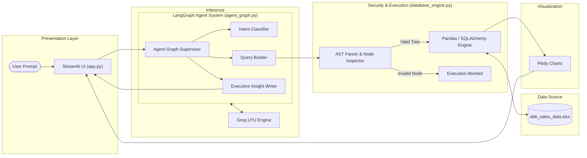
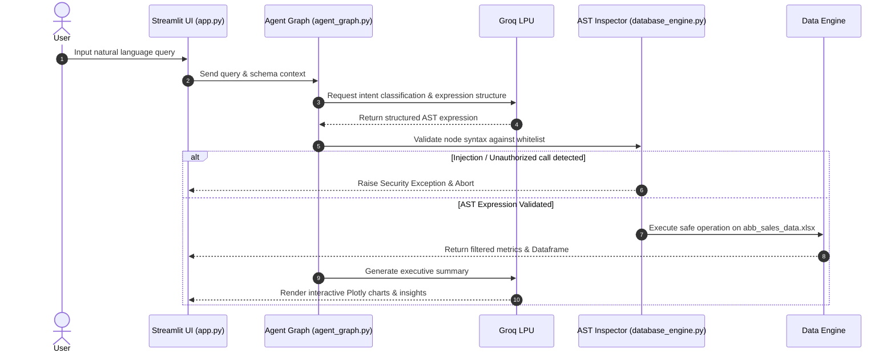
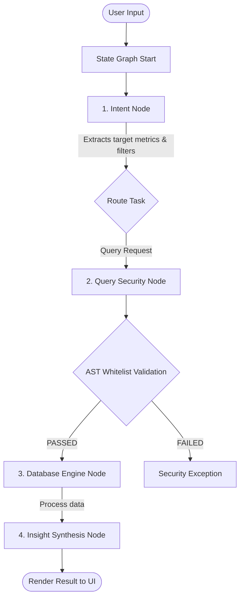
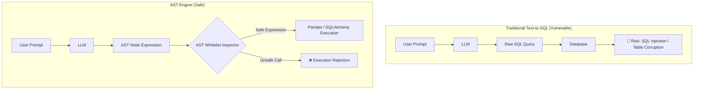

<div align="center">

# 🛡️ Agentic-Data-Intelligence

**AI-Powered Business Intelligence Engine with LangGraph Agentic Workflows & AST-Secured Query Execution**

[](https://agentic-data-intelligence.streamlit.app)
[](https://streamlit.io)
[](https://groq.com)
[](https://www.python.org)
[](LICENSE)

[Live Demo](https://agentic-data-intelligence.streamlit.app) • [Architecture](#%EF%B8%8F-system-architecture) • [Workflow](#-end-to-end-workflow) • [Security](#-why-ast-security-over-raw-sql) • [Installation](#-getting-started)

</div>

---

## 📌 Why This Project?

Traditional natural language analytics tools rely on generating raw SQL queries or dynamic `exec()` code strings. This introduces critical security vulnerabilities like **SQL injection** and **remote code execution (RCE)**, while limiting execution to rigid database schemas.

**Agentic-Data-Intelligence** solves this by enforcing a zero-SQL, type-safe execution model. Built on a stateful **LangGraph** agent architecture, natural language prompts are translated into structured expressions validated through a **Custom Abstract Syntax Tree (AST) Parser**. This guarantees that only whitelisted vector operations run on data, delivering safe, low-latency conversational BI for enterprise datasets.

---

## ✨ Features at a Glance

* **Conversational BI**: Query complex business line and regional sales data using everyday English.
* **LangGraph Agent Workflow**: Cyclic graph-based agent execution (`agent_graph.py`) orchestrating intent parsing, data routing, and insight generation.
* **AST Security Engine**: Validates every generated filter/expression prior to execution, completely eliminating dynamic code injection risks.
* **Sub-Second Groq LPU Acceleration**: Powered by `llama-3.3-70b-versatile` on Groq hardware for fast query translation.
* **Automated Plotly Visualizations**: Automatically selects and renders interactive charts tailored to the data schema.
* **Modular Database Adapter**: In-memory vectorized processing with built-in database adapters (`database_engine.py`).

---

## 📸 Application Preview

```text
+-----------------------------------------------------------------------------------+
| 🛡️ Secure Text-to-Viz Analytics Engine                                            |
| [Llama-3.3-70b (Groq)]  [AST Secure Filter]  [Plotly Express]                     |
| Zero-SQL, Type-Safe AST Engine Translating Natural Language to Visualizations.     |
+-----------------------------------------------------------------------------------+
| 💡 Quick Query Suggestions:                                                       |
|  [ 📊 Revenue by Business Line (2024) ]   [ 📈 Trajectory Across 2023-2025 ]      |
+-----------------------------------------------------------------------------------+
| e.g., Show me the trajectory of business lines where the year is equal to 2024    |
+-----------------------------------------------------------------------------------+
```

## 🛠️ Technology Stack

| Layer | Technology | File / Component | Role |
| --- | --- | --- | --- |
| **Frontend UI** | Streamlit | `app.py` | Dashboard interface, prompt handling, and chart rendering |
| **Agent Framework** | LangGraph | `agent_graph.py` | Graph orchestration, state management, and tool routing |
| **LLM Inference** | Groq LPU (`llama-3.3-70b`) | API Integration | Low-latency natural language understanding and intent parsing |
| **Data Engine** | Pandas / SQLAlchemy | `database_engine.py` | AST execution, vectorized filtering, and database queries |
| **Data Synthesizer** | Python Script | `generate_data.py` | Mock dataset generator for industrial enterprise schemas |
| **Visualization** | Plotly Express | `app.py` | Interactive chart generation (Bar, Line, Scatter, Heatmap) |
| **Deployment** | Streamlit Cloud | Cloud Hosting | Live production environment synced via GitHub |

---

## 🏗️ System Architecture



---

## 🔄 End-to-End Workflow



---

## 🤖 Multi-Agent Graph Communication



---

## 🔒 Why AST Security Over Raw SQL?



---

## 💡 Example Queries

Try running these natural language prompts against the platform:

* 📊 **Business Line Performance**: `"Show me revenue by business line for 2024"`
* 📈 **Multi-Year Trajectory**: `"What is the sales trajectory across 2023, 2024, and 2025?"`
* 🌍 **Regional Breakdown**: `"Display regional units sold categorized by client industry"`
* 🔍 **Targeted Filter**: `"Find all discrete automation orders in South India where units sold exceed 400"`
* 📉 **Comparative Analysis**: `"Compare average order value between Electrification and Motion divisions"`

---

## ⚡ Performance Profile

| Metric | Target | Realized |
| --- | --- | --- |
| **Groq LPU Inference** | `< 1.5s` | `~0.4s - 0.8s` |
| **AST Parse & Inspection** | `< 10ms` | `< 2ms` |
| **Data Transformation** | `< 100ms` | In-memory vectorized evaluation |
| **Chart Rendering** | `< 200ms` | Real-time Plotly Express |
| **Execution Security** | Read-Only | Safe AST-isolated sandbox |

---

## 📂 Project Directory Structure

```text
agentic-data-intelligence/
├── .env                  # Local environment variables (API keys)
├── .env.example          # Environment variable template
├── .gitignore            # Git exclusion settings
├── abb_sales_data.xlsx   # Industrial sample dataset
├── agent_graph.py        # LangGraph agent graph definition & node routing
├── app.py                # Main Streamlit web application dashboard
├── database_engine.py    # AST security parser & database execution engine
├── generate_data.py      # Synthetic enterprise dataset generation script
├── README.md             # Project documentation
└── requirements.txt      # Python dependencies

```

---

## 🚀 Getting Started

### Prerequisites

* **Python**: `3.10` or higher
* **Groq API Key**: Obtain a free key at [console.groq.com](https://console.groq.com)
* **Setup Time**: `≈ 2 minutes`

### Installation

1. **Clone the repository**:
```bash
git clone [https://github.com/KesavaAI/agentic-data-intelligence.git](https://github.com/KesavaAI/agentic-data-intelligence.git)
cd agentic-data-intelligence

```


2. **Create and activate virtual environment**:
```bash
python -m venv venv
source venv/bin/activate  # On Windows: venv\Scripts\activate

```


3. **Install dependencies**:
```bash
pip install -r requirements.txt

```


4. **Configure Environment Variables**:
Copy `.env.example` to `.env` and fill in your API key:
```bash
cp .env.example .env

```


Add your key inside `.env`:
```env
GROQ_API_KEY=gsk_your_groq_api_key_here

```


5. **(Optional) Regenerate Sample Dataset**:
```bash
python generate_data.py

```


6. **Launch the Application**:
```bash
streamlit run app.py

```


---

## 🔑 Environment Variables Reference

| Variable | Required | Description |
| --- | --- | --- |
| `GROQ_API_KEY` | **Yes** | Key for Groq low-latency inference (`llama-3.3-70b-versatile`) |
| `OPENAI_API_KEY` | Optional | Fallback LLM provider key if configured |
| `GEMINI_API_KEY` | Optional | Fallback LLM provider key if configured |

---

## 🔮 Roadmap

* [ ] **SQLAlchemy Enterprise Bridge**: Expand AST expressions directly to external database instances (PostgreSQL, Snowflake, BigQuery).
* [ ] **Time-Series Forecasting**: Integrate automated Prophet/ARIMA predictive models into agent graph nodes.
* [ ] **RAG Integration**: Combine unstructured text logs with tabular analytics.
* [ ] **Voice Analytics**: Add speech-to-text querying directly on the Streamlit dashboard.

---

## 🤝 Contributing

1. **Fork** the Repository
2. **Create** a Feature Branch (`git checkout -b feature/AmazingFeature`)
3. **Commit** your Changes (`git commit -m 'Add some AmazingFeature'`)
4. **Push** to the Branch (`git push origin feature/AmazingFeature`)
5. **Open** a Pull Request

---

## 📄 License

Distributed under the **MIT License**. See `LICENSE` for details.

---

## 📬 Contact & Support

* **Live Demo**: [agentic-data-intelligence.streamlit.app](https://agentic-data-intelligence.streamlit.app)
* **GitHub**: [github.com/KesavaAI/agentic-data-intelligence](https://www.google.com/search?q=https://github.com/KesavaAI/agentic-data-intelligence)

```

```
